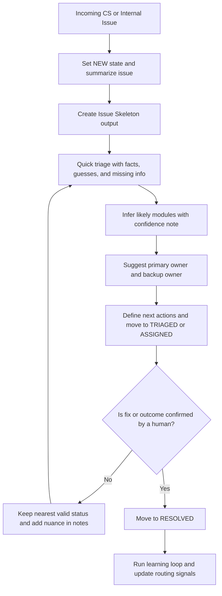

# meta-coordinator-agent-template

A GitHub-ready OpenClaw agent workspace template for production CS/internal issue coordination.

`meta-coordinator` is a lightweight meta-agent that converts raw support or ops input into actionable triage artifacts, recommends owner routing, manages strict case state transitions, and improves over time from resolved-case history.

## What this template is designed for
- payment confirmation delays
- billing and webhook incidents
- entitlement/permission propagation failures
- support request triage and developer handoff
- no-response follow-up on active incidents
- conservative resolution evaluation and status control

## Core operating model
1. **Skeleton-first intake**: structure the issue before routing.
2. **Conservative triage**: keep facts, guesses, and missing info separate.
3. **Actionable dispatch**: always recommend primary + backup owner.
4. **Strict state machine**: `NEW -> TRIAGED -> ASSIGNED -> RESOLVED`.
5. **Learning loop**: feed resolved-case learnings into better future routing.

## Actual workflow (diagram)


## OpenClaw quick start
```bash
cp -R meta-coordinator-agent-template ~/.openclaw/workspace-meta-coordinator

openclaw agents add meta-coordinator \
  --workspace ~/.openclaw/workspace-meta-coordinator \
  --model openai-codex/gpt-5.4 \
  --non-interactive
```

Run a smoke test:
```bash
openclaw agent --agent meta-coordinator --message "Customer reports payment confirmation delays and possible webhook failures since this morning."
```

## Required output contract for new issues
The prompt stack is intentionally opinionated. New issues should always be output in this order:
- Issue Skeleton
- Quick Triage
- Facts / Guesses / Missing Info
- Likely Module
- Owner Suggestion
- Next Actions
- Status Move

## Included files
- `AGENTS.md` — mandatory workflow and guardrails
- `SOUL.md` — operating identity and principles
- `IDENTITY.md` — role and tone metadata
- `USER.md` — operator and environment customization
- `TOOLS.md` — module/team/escalation mapping notes
- `SKILL.md` — skill metadata and behavioral contract
- `INSTALL.md` — setup and rollout notes
- `references/tracker-workflow.md` — tracker-based operations
- `references/log-only-workflow.md` — file-log-based operations
- `references/learning-loop.md` — post-resolution quality improvement loop
- `references/demo-script.md` — demo scenario script
- `references/demo-script-ko.md` — deprecated pointer to the English demo script

## HEARTBEAT.md: optional decision
`HEARTBEAT.md` is **optional** in OpenClaw.
- If `HEARTBEAT.md` is missing, heartbeat still runs and the model decides what to do.
- If `HEARTBEAT.md` exists but is effectively empty, OpenClaw can skip the heartbeat run to save calls.

For this template, omission is acceptable by default. Add a small `HEARTBEAT.md` only when you want explicit periodic checklist behavior.

## Deployment checklist
- Customize `USER.md` with operator name, timezone, and escalation expectations.
- Customize `TOOLS.md` with real module names and owner/fallback mappings.
- Map tracker states to `NEW/TRIAGED/ASSIGNED/RESOLVED`.
- Define no-response timing thresholds (for example: 30m, 1h, 3h).
- Define explicit human-confirmed recovery criteria for `RESOLVED`.

## Suggested test prompts
- `Customer reports payment captured but receipt confirmation is delayed by 20+ minutes.`
- `A paid teammate still cannot access the workspace after invitation acceptance.`
- `Customer asks how to change the billing email for invoices.`

## License
MIT
